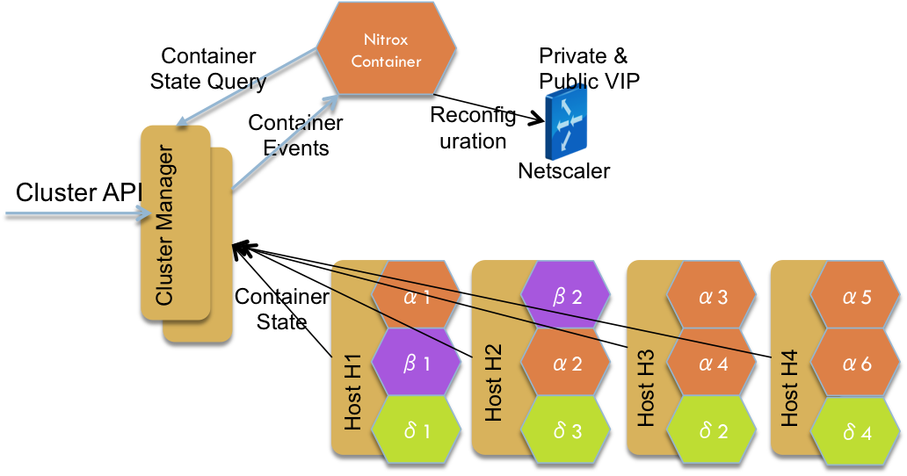

# Nitrox
Configure Citrix NetScaler loadbalancing for container platforms such as Docker Swarm, Mesos Marathon, Kubernetes and Consul.

# Theory of Operation
1. Containers that form a load-balanced backend for an app/microservice are labeled with the same label (e.g., com.citrix.lb.appname=AccountService, or AccountService) or name
2. Information (host IP and port) from the container platform (such as  [Docker Swarm](https://docs.docker.com/swarm/)) API for the labeled containers are used to configure a NetScaler loadbalancer.
3. The NetScaler admin creates the "frontend" `lb vserver` with the label/name used in #1



# NetScaler Pre-requisites

1. Credentials for a running Citrix NetScaler (VPX/MPX/SDX/CPX). On the host where you run the container/code, replace with your own:

   ````
   export NS_IP=10.220.73.33
   export NS_USER=nsroot
   export NS_PASSWORD=useyourownnspassword
   ````

2. List of microservices / apps that have to be load balanced. For example, 'AccountService', 'ProductCatalog', 'ShoppingCart', etc.
3. NetScaler that has been configured with VIP(s) for above apps. For example, lets say there is a microservice/app called 'AccountService' with a load balanced IP of 10.220.73.222. On the NetScaler:

    ```
    add lb vserver AccountService HTTP 10.220.73.222 80 -persistenceType COOKIE -lbMethod LEASTCONNECTION
    ```
    
    Alternatively, if the `lb_ip` and `lb_port` are included in the `APP_INFO` env variable, the `lb vserver` is configured automatically with some default options (`ROUNDROBIN`)
4. (for developers) The NetScaler Python SDK (can be downloaded here https://www.citrix.com/downloads/netscaler-adc/sdks.html or copied from the NetScaler)

#Container Platforms

### Docker Swarm
[Docker Swarm] (https://docs.docker.com/swarm/) is a clustered container manager. Instructions are [here](swarm/README.md)

### Marathon
[Marathon] (https://mesosphere.github.io/marathon/) is a PAAS framework that can run containerized workloads. Instructions are [here](marathon/README.md)

### Kubernetes
[Kubernetes] (https://kubernetes.io/) is an open source orchestration system for Docker containers. It . Instructions are [here](kubernetes/README.md)

### Consul-template
[consul-template] (https://github.com/hashicorp/consul-template)  provides a convenient way to populate values from Consul.  Instructions are [here](consul/README.md)
